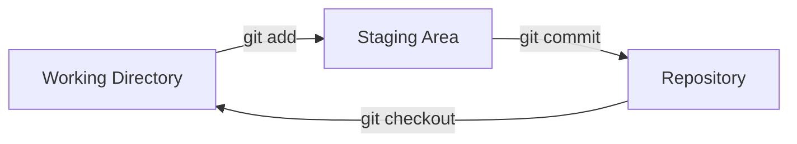

# Essential Everyday Git Commands and Workflows

*Your guide to the fundamental Git operations you'll use in daily development work.*

---

## The Basic Git Workflow

Git operations follow a three-step workflow that moves changes through different areas:



1. **Working Directory**: Where you modify files
2. **Staging Area (Index)**: Where you prepare changes for commit
3. **Repository (.git)**: Where Git permanently stores changes as commits

This workflow allows you to:

- Work on multiple changes simultaneously
- Craft fine-grained commits that group related changes
- Review and refine changes before committing them

---

## Working with Files

### Checking Status

Check the status of your working directory:

#### See status with detailed information

```sh
git status
```

#### See a compact status display

```sh
git status -s
```

Or:

```sh
git status --short
```

Status codes in short format:

- `??` = Untracked files
- `A` = Files added to stage
- `M` = Modified files
- `D` = Deleted files
- Left column = staging area, Right column = working directory

### Adding Files

Stage files for the next commit:

#### Add a specific file

```sh
git add filename.txt
```

#### Add multiple files

```sh
git add file1.txt file2.txt
```

#### Add all files in the current directory

```sh
git add .
```

#### Add all files in the entire repository

```sh
git add -A
```

Or:

```sh
git add --all
```

#### Add files interactively

Review each change:

```sh
git add -p
```

Or:

```sh
git add --patch
```

#### Add all tracked files with modifications

```sh
git add -u
```

Or:

```sh
git add --update
```

### Ignoring Files

Use a `.gitignore` file to exclude files from being tracked:

#### Create a .gitignore file

```sh
touch .gitignore
```

Common patterns for `.gitignore`:

```plaintext
# Ignore specific file
specific-file.txt

# Ignore file type
*.log
*.tmp

# Ignore entire directory
logs/
temp/
node_modules/

# Ignore all except specific files
*.json
!package.json
!package-lock.json

# Ignore files with tilde at the end (backup files)
*~
```

> 💡 **Tip**: Find pre-configured `.gitignore` templates for various project types at [github.com/github/gitignore](https://github.com/github/gitignore)

### Moving and Renaming Files

Git treats renaming as a delete and add operation, but provides a shortcut:

#### Rename a file and update the index

```sh
git mv old-name.txt new-name.txt
```

#### Move a file to a different directory

```sh
git mv file.txt path/to/new/location/
```

### Deleting Files

Remove files from both the working directory and the index:

#### Remove a file

```sh
git rm filename.txt
```

#### Remove a file that has already been deleted from the filesystem

```sh
git rm --cached filename.txt
```

#### Remove a directory recursively

```sh
git rm -r directory/
```

---

## Making Commits

### Creating Commits

Record staged changes as a commit:

#### Create a commit with a message

```sh
git commit -m "Add feature X"
```

#### Create a commit with a multiline message

Opens editor:

```sh
git commit
```

#### Add and commit tracked files in one command

```sh
git commit -am "Fix bug in feature Y"
```

#### Add all changes and commit with a message

```sh
git add -A && git commit -m "Implement feature Z"
```

#### Add only specified files and commit in one step

```sh
git commit file1.txt file2.txt -m "Update specific files"
```

### Writing Good Commit Messages

Structure your commit messages for better readability and history:

```plaintext
Short summary (50 chars or less)

More detailed explanatory text, if necessary. Wrap it to about 72
characters. The blank line separating the summary from the body is
critical (unless you omit the body entirely).

- Bullet points are okay
- Typically a hyphen or asterisk is used, preceded by a space

Relates to: #123
```

> 💡 **Tip**: Follow the "50/72" rule: Keep the first line under 50 characters and other lines under 72 characters.

### Amending Commits

Update the most recent commit:

#### Change the commit message of the latest commit

```sh
git commit --amend -m "New commit message"
```

#### Add missed changes to the latest commit without changing the message

```sh
git add forgotten-file.txt
git commit --amend --no-edit
```

#### Amend author information for the latest commit

```sh
git commit --amend --author="New Name <new.email@example.com>"
```

> ⚠️ **Warning**: Never amend commits that have been pushed to a shared repository unless you're absolutely certain no one else has based their work on them.

### Commit Best Practices

1. **Commit Atomic Changes**: Each commit should represent a single logical change
2. **Commit Frequently**: Smaller, more focused commits are easier to understand and review
3. **Write Meaningful Messages**: Explain what changed and why (not how)
4. **Use Present Tense**: "Add feature" instead of "Added feature"
5. **Reference Issues**: Include issue/ticket numbers in commit messages when applicable

---

## Viewing Changes

### Viewing Uncommitted Changes

Compare your working directory or staging area with the repository:

#### Show unstaged changes

```sh
git diff
```

#### Show staged changes

```sh
git diff --staged
```

Or:

```sh
git diff --cached
```

#### Show all changes (staged and unstaged)

```sh
git diff HEAD
```

#### Show changes for a specific file

```sh
git diff -- filename.txt
```

### Viewing Commit History

View the commit history of your repository:

#### Show commit history

```sh
git log
```

#### Show commit history with a graph

```sh
git log --graph
```

#### Show compact commit history (one line per commit)

```sh
git log --oneline
```

#### Show commits with patches (diffs)

```sh
git log -p
```

#### Show statistics for each commit

```sh
git log --stat
```

#### Show commit history for a specific file

```sh
git log -- filename.txt
```

#### Show commit history with date ranges

```sh
git log --since="2 weeks ago"
```

```sh
git log --until="yesterday"
```

### Examining Specific Commits

Inspect specific commits in detail:

#### Show details of a specific commit

```sh
git show commit_hash
```

#### Show changes in a specific file from a commit

```sh
git show commit_hash:filename.txt
```

#### Show the content of a file at a specific commit

```sh
git show commit_hash:filename.txt
```

---

## Undoing Changes

### Discarding Working Directory Changes

Discard uncommitted changes:

#### Discard changes to a specific file in working directory

```sh
git restore filename.txt
```

Or (older syntax):

```sh
git checkout -- filename.txt
```

#### Discard all changes in working directory

```sh
git restore .
```

Or (older syntax):

```sh
git checkout -- .
```

### Unstaging Changes

Remove changes from the staging area:

#### Unstage a specific file

```sh
git restore --staged filename.txt
```

Or (older syntax):

```sh
git reset HEAD filename.txt
```

#### Unstage all files

```sh
git restore --staged .
```

Or (older syntax):

```sh
git reset HEAD
```

### Reverting Commits

Create new commits that undo previous commits:

#### Revert the most recent commit

```sh
git revert HEAD
```

#### Revert a specific commit

```sh
git revert commit_hash
```

#### Revert multiple commits

```sh
git revert older_commit_hash..newer_commit_hash
```

#### Revert a merge commit

```sh
git revert -m 1 merge_commit_hash
```

> 💡 **Tip**: Revert is the safest way to undo changes that have been shared with others since it doesn't alter history.

### Resetting

Move branch pointer to a different commit (use with caution):

#### Reset staging area to match most recent commit

Leaves working directory unchanged:

```sh
git reset
```

#### Reset staging area and working directory to match most recent commit

```sh
git reset --hard
```

#### Move current branch to a specific commit, keeping changes in working directory

```sh
git reset commit_hash
```

#### Move current branch to a specific commit, discarding all changes

```sh
git reset --hard commit_hash
```

#### Move current branch to a specific commit, keeping changes as unstaged

```sh
git reset --mixed commit_hash
```

> ⚠️ **Warning**: `git reset --hard` permanently discards changes. Be absolutely certain before using it.

---

## Working with References

### HEAD and Other References

Git has several ways to refer to commits:

- `HEAD`: Points to the latest commit in the current branch
- `HEAD^`: Parent of HEAD (previous commit)
- `HEAD~2`: Grandparent of HEAD (2 commits back)
- `main`: Points to the latest commit in the main branch
- `tag_name`: Points to the commit associated with a specific tag

#### Show where HEAD points

```sh
git rev-parse HEAD
```

#### Show the parent of HEAD

```sh
git show HEAD^
```

#### Show a commit 3 commits before HEAD

```sh
git show HEAD~3
```

### Using Commit Hashes

Every commit in Git has a unique hash identifier:

#### Show the full hash of a commit

```sh
git rev-parse HEAD
```

#### Use the short form of a commit hash

```sh
git show a1b2c3d
```

> 💡 **Tip**: You only need the first few characters of a commit hash (usually 7+) to uniquely identify it.

---

## Command Summary

| Command | Common Options | Description |
|---------|---------------|-------------|
| `git status` | `-s`, `--short` | Check repository status |
| `git add` | `.`, `-p`, `-A`, `-u` | Stage changes |
| `git commit` | `-m`, `-am`, `--amend` | Record changes |
| `git diff` | `--staged`, `--name-only` | View changes |
| `git log` | `--oneline`, `--graph`, `-p` | View history |
| `git show` | `commit_hash`, `HEAD` | Inspect specific commit |
| `git restore` | `--staged`, `--source=HEAD` | Undo changes |
| `git rm` | `--cached`, `-r` | Remove files |
| `git mv` | | Move/rename files |

---

## Related Topics

- [Setting up Git and initializing repositories](setup-and-init.md)
- [Creating, managing, and navigating branches](branching.md)
- [Temporarily storing changes and cleaning working directory](stash-clean.md)
- [Viewing project history and comparing changes](logs-diffs-history.md)
