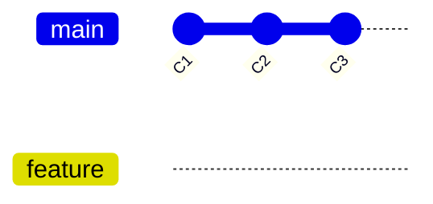
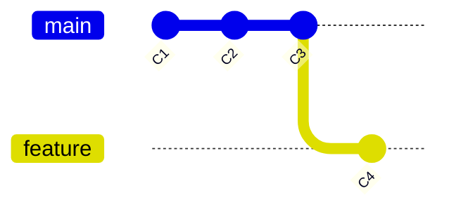
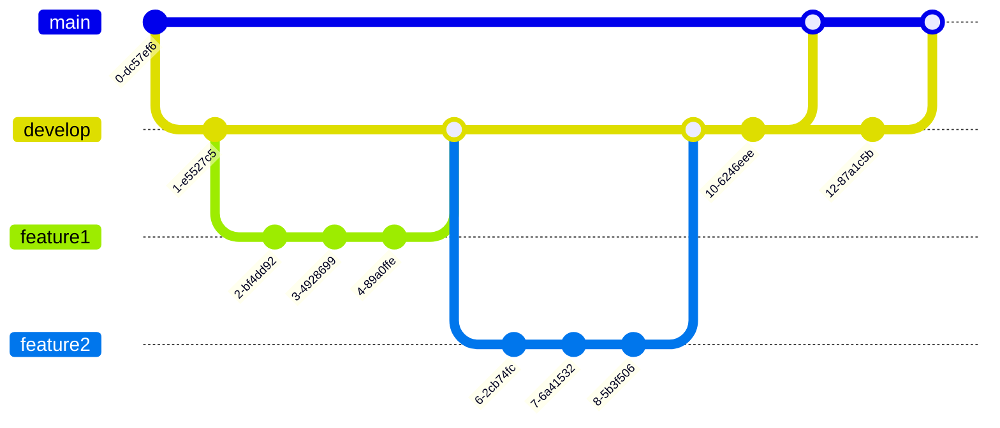
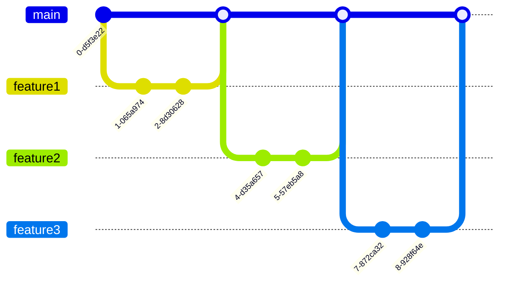
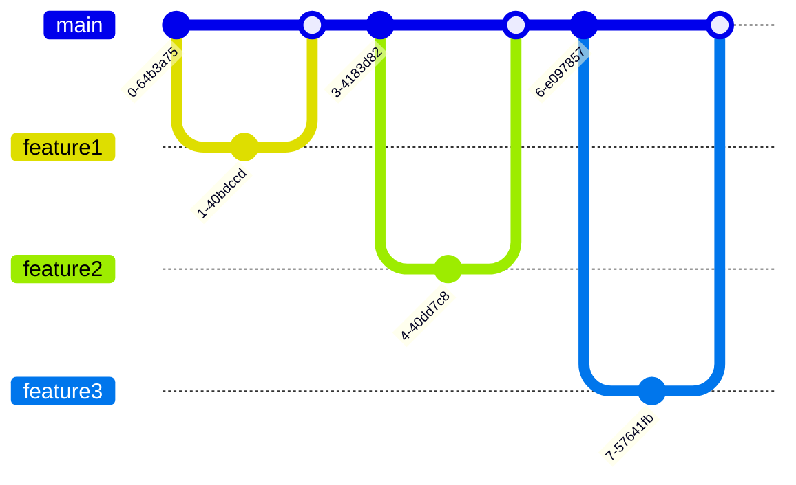

# Creating, Managing, and Navigating Branches

*Master the art of Git branching to organize parallel streams of development work.*

---

## Understanding Branches

### What is a Branch?

A branch in Git is simply a lightweight movable pointer to a commit. The default branch name in Git is `main` (or `master` in older repositories).

When you create a branch, you're creating a new pointer to the same commit you're currently on:



When you add a new commit to the feature branch, it moves forward while the main branch stays at the same commit:



### Branch Visualization

To visualize your branch structure, use:

#### Show branch structure with decorations

```sh
git log --graph --oneline --decorate --all
```

#### Create a colorful visualization alias

```sh
git config --global alias.visual "log --graph --abbrev-commit --decorate --format=format:'%C(bold blue)%h%C(reset) - %C(bold green)(%ar)%C(reset) %C(white)%s%C(reset) %C(dim white)- %an%C(reset)%C(auto)%d%C(reset)' --all"
```

Then use:

```sh
git visual
```

---

## Creating Branches

### Creating a New Branch

Create a branch that points to your current commit:

#### Create a branch without switching

```sh
git branch <branch-name>
```

Example:

```sh
git branch feature-login
```

### Create and Switch in One Command

Create a new branch and switch to it immediately:

#### Using checkout (traditional approach)

```sh
git checkout -b <branch-name>
```

#### Using switch (modern approach, Git 2.23+)

```sh
git switch -c <branch-name>
```

Examples:

```sh
git checkout -b feature-notifications
```

```sh
git switch -c hotfix-login-bug
```

### Create Branch from a Specific Commit

Create a branch starting from a specified commit:

#### Create branch from a commit hash

```sh
git branch <branch-name> <commit-hash>
```

#### Create and switch in one command

```sh
git checkout -b <branch-name> <commit-hash>
```

```sh
git switch -c <branch-name> <commit-hash>
```

Examples:

```sh
git branch historical-version 7d3a2c1
```

```sh
git checkout -b fix-old-bug 5e7a91f
```

### Create Branch from a Tag

Create a branch starting from a tagged version:

#### Create and switch to a branch from a tag

```sh
git checkout -b <branch-name> <tag-name>
```

```sh
git switch -c <branch-name> <tag-name>
```

Example:

```sh
git checkout -b hotfix-v1.2 v1.2.0
```

---

## Viewing Branches

### List Branches

View the branches in your repository:

#### List local branches

```sh
git branch
```

#### List all branches (local and remote)

```sh
git branch -a
```

#### List remote branches only

```sh
git branch -r
```

#### List branches with more details

```sh
git branch -v
```

Show last commit on each branch:

```sh
git branch -vv
```

Also show upstream branches:

#### List merged branches

```sh
git branch --merged
```

Branches merged into HEAD:

```sh
git branch --no-merged
```

Branches not merged into HEAD

### View Branch Details

Get more information about a specific branch:

#### Show the commit hash that the branch points to

```sh
git rev-parse <branch-name>
```

#### See what remote branch a local branch is tracking

```sh
git branch -vv | grep <branch-name>
```

#### Show commit history for a specific branch

```sh
git log <branch-name>
```

#### Show the most recent commit on a branch

```sh
git show <branch-name>
```

---

## Switching Between Branches

### Switch to a Different Branch

Move to a different branch in your repository:

#### Traditional way (still widely used)

```sh
git checkout <branch-name>
```

#### Modern way (Git 2.23+)

```sh
git switch <branch-name>
```

Examples:

```sh
git checkout develop
```

```sh
git switch feature-user-profile
```

> 💡 **Tip**: Git won't let you switch branches if you have uncommitted changes that conflict with the target branch. Either commit, stash, or discard your changes first.

### The Modern `switch` Command

Git 2.23+ introduced `switch` as a clearer alternative to the overloaded `checkout` command:

#### Basic branch switching

```sh
git switch <branch-name>
```

#### Create and switch to a new branch

```sh
git switch -c <new-branch-name>
```

#### Return to the previous branch

```sh
git switch -
```

### Switch to Previous Branch

Quickly jump back to the branch you were on before:

#### Switch to the last branch you were on

```sh
git checkout -
```

Or:

```sh
git switch -
```

---

## Deleting Branches

### Delete a Fully Merged Branch

Remove a branch that has been fully merged into the current branch:

#### Safe delete (will fail if branch has unmerged changes)

```sh
git branch -d <branch-name>
```

Example:

```sh
git branch -d feature-completed
```

### Force Delete an Unmerged Branch

Delete a branch even if it contains unmerged changes:

#### Force delete

```sh
git branch -D <branch-name>
```

Example:

```sh
git branch -D experimental-feature
```

> ⚠️ **Warning**: This permanently discards all commits unique to this branch if they haven't been merged elsewhere.

### Delete Remote Branch

Remove a branch from a remote repository:

#### Delete a remote branch

```sh
git push <remote-name> --delete <branch-name>
```

Alternate syntax:

```sh
git push <remote-name> :<branch-name>
```

Examples:

```sh
git push origin --delete feature-removed
```

```sh
git push origin :old-feature
```

---

## Renaming Branches

### Rename Current Branch

Change the name of the branch you're currently on:

#### Rename the current branch

```sh
git branch -m <new-branch-name>
```

Example:

```sh
git branch -m better-feature-name
```

### Rename Any Branch

Change the name of a branch while on a different branch:

#### Rename any branch

```sh
git branch -m <old-branch-name> <new-branch-name>
```

Example:

```sh
git branch -m old-feature-name new-feature-name
```

### Renaming the Main Branch

To rename your default branch (e.g., from `master` to `main`):

#### Create a new branch called main from master

```sh
git branch -m master main
```

#### Push the new main branch and set up tracking

```sh
git push -u origin main
```

#### Change default branch on GitHub/GitLab/etc. (via web interface)

#### Delete the old master branch from remote

```sh
git push origin --delete master
```

---

## Working with Remote Branches

### Pushing a Branch to Remote

Share your local branch with others by pushing it to a remote repository:

#### Push a branch to the remote for the first time

```sh
git push -u origin <branch-name>
```

Or:

```sh
git push --set-upstream origin <branch-name>
```

#### Subsequent pushes after tracking is established

```sh
git push
```

#### Force push (use with caution!)

```sh
git push --force
```

Or:

```sh
git push -f
```

> ⚠️ **Warning**: Force pushing rewrites history on the remote. Never force push to shared branches unless you're absolutely certain it's safe.

### Setting Upstream Branch

Connect your local branch to a remote branch for tracking:

#### Set upstream branch when pushing

```sh
git push -u origin <branch-name>
```

#### Set upstream for an existing branch

```sh
git branch --set-upstream-to=origin/<branch-name> <local-branch-name>
```

Or shorter:

```sh
git branch -u origin/<branch-name>
```

### Tracking Remote Branches

Create a local branch that tracks a remote branch:

#### Create a local branch from remote

```sh
git checkout -b <branch-name> origin/<branch-name>
```

#### Newer syntax (Git 2.23+)

```sh
git switch -c <branch-name> origin/<branch-name>
```

#### Easiest way - creates a local branch with the same name

```sh
git checkout --track origin/<branch-name>
```

Or even shorter if branch names match:

```sh
git checkout <branch-name>
```

### List Remote Branches

View branches that exist on the remote server:

#### Show remote branches

```sh
git branch -r
```

#### Show remote branches with more details

```sh
git branch -rv
```

### Fetch Remote Branches

Update your local references to remote branches:

#### Fetch updates from all remotes

```sh
git fetch
```

#### Fetch from a specific remote

```sh
git fetch origin
```

#### Fetch a specific branch

```sh
git fetch origin <branch-name>
```

---

## Branch Management Strategies

### Branch Naming Conventions

A good branch naming strategy helps team members understand branch purpose:

```plaintext
<type>/<description>
```

Common types include:

- `feature/` - New functionality
- `bugfix/` - Bug fixes
- `hotfix/` - Urgent fixes for production
- `release/` - Release preparation
- `refactor/` - Code refactoring
- `docs/` - Documentation updates
- `test/` - Test additions or changes

Examples:

```plaintext
feature/user-authentication
bugfix/login-validation
hotfix/security-vulnerability
release/v2.1.0
```

### Common Branching Models

**GitFlow:**
A structured branching model with dedicated branches for development, features, releases, and hotfixes.



**GitHub Flow:**
A simpler workflow based on feature branches and pull requests.



**Trunk-Based Development:**
Features are developed in very short-lived branches or directly on the main branch.



---

## Branch Operations

### Find Branches Containing a Specific Commit

Locate which branches include a particular commit:

#### List all branches containing a commit

```sh
git branch --contains <commit-hash>
```

#### Include remote branches

```sh
git branch -a --contains <commit-hash>
```

### Find Last Commit on a Branch

View the most recent commit on a branch:

#### Show the tip commit of a branch

```sh
git show <branch-name>
```

#### Just the commit hash

```sh
git rev-parse <branch-name>
```

#### Show commit message only

```sh
git log -1 --pretty=format:"%s" <branch-name>
```

### Compare Branches

See what commits differ between branches:

#### Commits in branch-A that aren't in branch-B

```sh
git log branch-B..branch-A
```

#### Just the commit summaries

```sh
git log --oneline branch-B..branch-A
```

#### Show the diff between two branches

```sh
git diff branch-A..branch-B
```

#### Show only the file names that differ

```sh
git diff --name-only branch-A..branch-B
```

---

## Command Summary

| Operation | Command | Description |
|-----------|---------|-------------|
| Create | `git branch <name>` | Create new branch |
| Create & Switch | `git checkout -b <name>` or `git switch -c <name>` | Create and switch to branch |
| List | `git branch` or `git branch -a` | List branches (local/all) |
| Switch | `git checkout <name>` or `git switch <name>` | Move to branch |
| Delete | `git branch -d <name>` or `git branch -D <name>` | Delete branch (safe/force) |
| Rename | `git branch -m <name>` or `git branch -m <old> <new>` | Rename branch |
| Push | `git push -u origin <name>` | Push and track branch |
| Compare | `git diff branch1..branch2` | Compare branches |
| Merge | `git merge <branch>` | Merge branch into current |

---

## Related Topics

- [Setting up Git and initializing repositories](setup-and-init.md)
- [Essential everyday Git commands and workflows](basic-usage.md)
- [Combining branches with merge and rebase operations](merging-rebasing.md)
- [Working with remote repositories (push, pull, fetch)](remote-operations.md)
- [Established Git workflows for teams](development-workflows.md)
