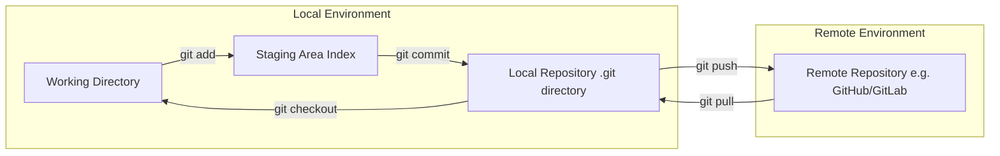
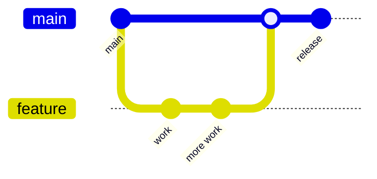
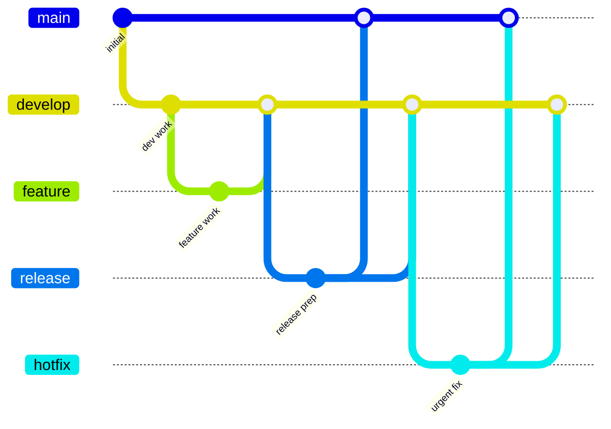
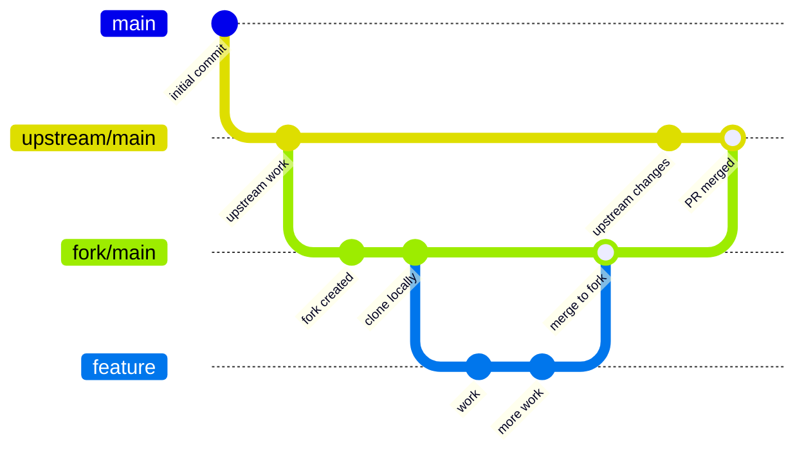

# Git Introduction

*A comprehensive overview of Git concepts, workflows, and fundamental operations.*

---

## How Git Works

Git tracks changes through a series of snapshots. Here's a visual representation of how data flows through Git's core components:



## How to Use This Guide

- **Browse by Topic**: Use the Table of Contents to find specific git operations
- **Quick Copy**: All commands are formatted for easy copy-pasting
- **Detailed Pages**: Click section links for comprehensive guides on each topic
- **Workflow Reference**: Refer to the workflow diagrams for common git patterns

---

## Getting Started: Core Basics

### Repository Initialization

**Initialize a new git repository:**

```sh
git init
```

**Clone an existing repository:**

```sh
git clone <repo-url>
```

**Set user identity (global):**

```sh
git config --global user.name "Your Name"
```

```sh
git config --global user.email "your@email"
```

### Ignoring & Keeping Files

**Add a `.gitignore` file:**

Defines intentionally untracked files to ignore.

```sh
touch .gitignore
```

**Track an otherwise empty directory (with `.gitkeep`):**

Create directory:

```sh
mkdir -p some/empty/dir
```

Create .gitkeep file:

```sh
touch some/empty/dir/.gitkeep
```

> *Note: `.gitkeep` is not built-in but is a common convention.*

### Basic Git Workflow

**Stage changes:**

Stage specific file:

```sh
git add <filename>
```

Stage all changes:

```sh
git add .
```

**Commit changes:**

Commit with message:

```sh
git commit -m "Descriptive message"
```

Add and commit tracked files in one step:

```sh
git commit -am "Add and commit in one step"
```

**Check status:**

Full status:

```sh
git status
```

Short format:

```sh
git status -s
```

**View changes:**

Unstaged changes:

```sh
git diff
```

Staged changes:

```sh
git diff --staged
```

---

## Common Git Workflows

### Feature Branch Workflow

Common in team environments where features are developed in isolation.



### Gitflow Workflow

A structured branching model with dedicated branches for development, features, releases, and hotfixes.



### Forking Workflow

Popular in open source projects, where contributors fork the main repository.


