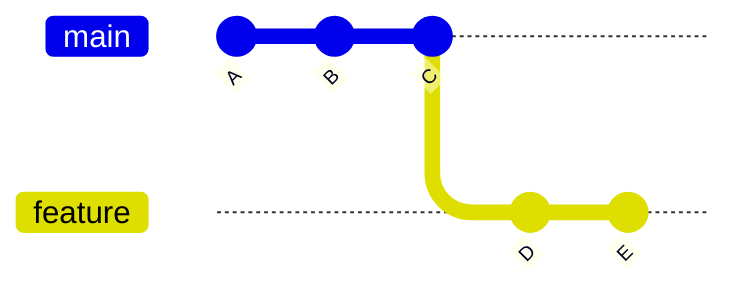
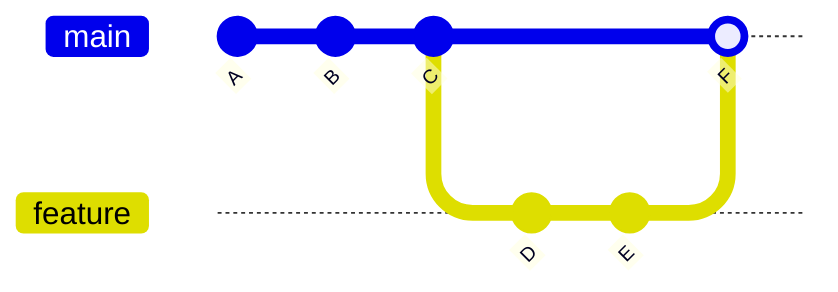
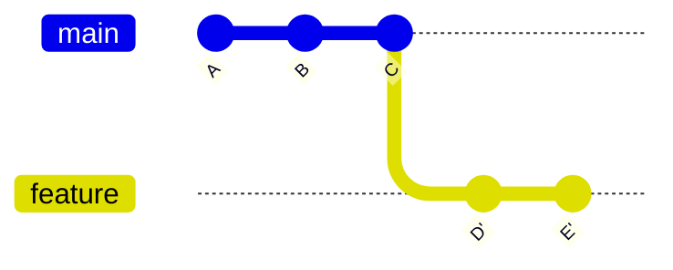

# Combining Branches with Merge and Rebase Operations

*Master the art of integrating changes between branches with merge and rebase techniques.*

---

## Understanding Branch Integration

### Merge vs. Rebase

Git offers two primary ways to integrate changes from one branch into another:

**Merging:**

- Creates a new "merge commit" that combines changes from both branches
- Preserves complete history and chronological ordering
- Non-destructive operation (doesn't change existing commits)

**Rebasing:**

- Moves the entire branch to begin on the tip of another branch
- Creates new commits that replicate the original changes
- Results in a linear project history
- Rewrites commit history (alters existing commits)

### Visual Comparison

**Before integration:**



**After merge:**



**After rebase:**



### When to Use Each Approach

**Use merge when:**

- You want to preserve the complete history and chronology
- The branch is public/shared with other developers
- You want to capture that a feature was developed in parallel
- You need to merge a long-running branch back to main

**Use rebase when:**

- You want a clean, linear history
- The branch is a local, private branch not shared with others
- You want to integrate the latest changes from main into your feature branch
- You're cleaning up your branch before merging

> ⚠️ **Golden Rule of Rebasing**: Never rebase commits that have been pushed to a public repository that others might have based work on.

---

## Merging Branches

### Basic Merge

Combine changes from a source branch into your current branch:

#### Switch to the target branch

```sh
git checkout main
```

#### Merge the source branch into the current branch

```sh
git merge feature-branch
```

### Fast-Forward Merge

A fast-forward merge occurs when the target branch pointer simply moves forward to the source branch pointer:

#### Perform a fast-forward merge

```sh
git merge feature-branch
```

This happens when there are no new commits in the target branch since the source branch was created.

### No Fast-Forward Merge

Create a merge commit even when a fast-forward is possible:

#### Create a merge commit always

```sh
git merge --no-ff feature-branch
```

> 💡 **Tip**: The `--no-ff` flag is useful for documenting that a feature branch once existed, even if it could be fast-forwarded.

### Squash Merge

Combine all commits from the source branch into a single commit on the target branch:

#### Squash merge

```sh
git merge --squash feature-branch
```

#### Commit the squashed changes

```sh
git commit -m "Merge feature-branch with squash: Feature description"
```

> 💡 **Tip**: Squash merging is useful when the individual commits in a feature branch aren't important for the project history.

### Aborting a Merge

If you encounter issues during a merge, you can abort it:

#### Abort an in-progress merge

```sh
git merge --abort
```

---

## Rebasing Branches

### Basic Rebase

Move your branch's changes to start from the tip of another branch:

#### Switch to the branch you want to rebase

```sh
git checkout feature-branch
```

#### Rebase onto the target branch

```sh
git rebase main
```

### Interactive Rebase

Modify commits during the rebase process:

#### Interactive rebase for the last 3 commits

```sh
git rebase -i HEAD~3
```

#### Interactive rebase onto another branch

```sh
git rebase -i main
```

Interactive rebase opens an editor with a list of commits and actions:

```plaintext
pick 1a2b3c4 First commit message
pick 2b3c4d5 Second commit message
pick 3c4d5e6 Third commit message

# Commands:
# p, pick <commit> = use commit
# r, reword <commit> = use commit, but edit the commit message
# e, edit <commit> = use commit, but stop for amending
# s, squash <commit> = use commit, but meld into previous commit
# f, fixup <commit> = like "squash", but discard this commit's log message
# d, drop <commit> = remove commit
```

> 💡 **Tip**: Interactive rebasing is powerful for cleaning up your commit history before sharing it.

### Aborting a Rebase

If you encounter issues during a rebase:

#### Abort an in-progress rebase

```sh
git rebase --abort
```

### Continuing a Rebase

After resolving conflicts during a rebase:

#### Continue the rebase after resolving conflicts

```sh
git rebase --continue
```

#### Skip the current commit in the rebase

```sh
git rebase --skip
```

---

## Handling Merge Conflicts

### Understanding Conflicts

Conflicts occur when Git can't automatically merge changes because both branches modified the same part of a file.

Git marks conflicts in files with conflict markers:

```plaintext
  <<<<<<< HEAD
  # Changes from the current branch
  ========
  # Changes from the branch being merged
  >>>>>>> feature-branch
```

### Resolving Merge Conflicts

When Git encounters conflicts during a merge, you'll need to resolve them manually.

#### Identify Conflicted Files

First, check which files have conflicts:

```sh
git status
```

Files with conflicts will be listed as "both modified" in the status output.

#### Edit Conflicted Files

Open each conflicted file in your editor and look for conflict markers (`<<<<<<<`, `=======`, `>>>>>>>`). For each conflict:

```sh
# Edit the file to resolve conflicts:
# 1. Remove the conflict markers
# 2. Choose which changes to keep or combine them
# 3. Save the file
```

#### Mark Resolved Files

After editing, tell Git that you've resolved the conflicts by staging the files:

```sh
git add path/to/resolved/file.txt
```

Stage each file after you've resolved its conflicts.

#### Complete the Merge

Once all conflicts are resolved and staged, complete the merge:

```sh
git commit
```

Git will open your editor with a default merge commit message that you can modify if needed.

### Resolving Rebase Conflicts

Resolving conflicts during a rebase is similar to merge conflict resolution, but with a slightly different workflow.

#### Identify and Edit Conflicted Files

When a rebase stops due to conflicts:

```sh
git status
```

Open and edit each conflicted file as with merge conflicts.

#### Stage Resolved Files

After resolving each conflict, mark the file as resolved:

```sh
git add path/to/resolved/file.txt
```

#### Continue the Rebase Process

Once conflicts in the current commit are resolved, continue the rebase:

```sh
git rebase --continue
```

Git may stop again if there are conflicts in subsequent commits. Repeat the resolution process for each stopping point.

#### Skip or Abort (If Needed)

If you want to skip applying the current commit:

```sh
git rebase --skip
```

If you want to cancel the entire rebase operation:

```sh
git rebase --abort
```

### Using Merge Tools

Git can use visual merge tools to help resolve conflicts:

#### Use the configured merge tool

```sh
git mergetool
```

#### Set up a default merge tool

```sh
git config --global merge.tool <tool-name>
```

Common merge tools include:

- `meld`
- `kdiff3`
- `vimdiff`
- `vscode`

### Conflict Prevention Strategies

1. **Pull regularly** from the target branch to minimize drift
2. **Communicate with team members** about which files you're working on
3. **Break large changes into smaller, focused commits**
4. **Keep feature branches short-lived**
5. **Use `.gitattributes` to set merge strategies** for specific file types

---

## Cherry-Picking Commits

### Basic Cherry-Pick

Apply a specific commit from one branch to another:

#### Switch to the destination branch

```sh
git checkout main
```

#### Cherry-pick a commit

```sh
git cherry-pick <commit-hash>
```

### Cherry-Picking Multiple Commits

Apply a range of commits:

#### Cherry-pick a range (exclusive of first commit)

```sh
git cherry-pick <start-commit>..<end-commit>
```

#### Cherry-pick a range (inclusive of first commit)

```sh
git cherry-pick <start-commit>^..<end-commit>
```

### When to Cherry-Pick

- Applying a specific bugfix to multiple branches
- Selectively pulling changes when a full merge isn't appropriate
- Recovering specific work from an abandoned branch

> ⚠️ **Warning**: Cherry-picking creates duplicate commits with different hashes, which can complicate history if those changes are later merged normally.

---

## Advanced Branch Operations

### Merge Specific Files

Merge a specific file from another branch:

#### Get file from another branch

```sh
git checkout <branch-name> -- <file-path>
```

#### Example: Get a file from the feature branch

```sh
git checkout feature-branch -- src/utils/helpers.js
```

### Rebase onto Another Branch

Move your changes to be based on a completely different branch:

#### Rebase feature branch onto a new base

```sh
git rebase --onto <new-base> <old-base> <branch>
```

#### Example

```sh
git rebase --onto main old-feature feature-branch
```

### Updating a Long-Running Branch

Keep a long-running branch up to date with its parent:

#### Option 1: Merge approach

```sh
git checkout feature-branch
git merge main
```

#### Option 2: Rebase approach

```sh
git checkout feature-branch
git rebase main
```

### Recovering from Bad Merges

If you need to undo a merge:

#### Undo the last merge commit but keep all changes

```sh
git reset --soft HEAD^
```

#### Completely discard the merge and all changes

```sh
git reset --hard HEAD^
```

#### Revert a merge commit that has been pushed

```sh
git revert -m 1 <merge-commit-hash>
```

---

## Best Practices

### General Guidelines

1. **Understand what you're doing** before merging or rebasing
2. **Commit your work** before starting a merge or rebase
3. **Consider creating a backup branch** before complex operations:

   #### Create a backup branch

   ```sh
   git branch backup-branch
   ```

4. **Prefer `merge` for public branches** and `rebase` for private branches
5. **Write clear merge commit messages** that explain the purpose of the integration

### Team Workflows

1. **Agree on a branching strategy** with your team
2. **Document guidelines** for when to merge vs. rebase
3. **Establish standards** for commit messages and merge requests
4. **Use pull/merge requests** for code review before integration
5. **Consider configuring branch protection rules** in GitHub/GitLab

### Common Pitfalls to Avoid

1. **Rebasing public branches** that others depend on
2. **Force pushing** after rewriting history
3. **Merging without understanding** the changes being integrated
4. **Not resolving conflicts properly**, just picking one side
5. **Forgetting to complete** a merge or rebase after resolving conflicts

---

## Command Summary

| Operation | Command | Description |
|-----------|---------|-------------|
| Basic Merge | `git merge <branch>` | Combine branch into current |
| No Fast-Forward | `git merge --no-ff <branch>` | Always create a merge commit |
| Squash Merge | `git merge --squash <branch>` | Combine into a single commit |
| Abort Merge | `git merge --abort` | Cancel an in-progress merge |
| Basic Rebase | `git rebase <branch>` | Replay commits onto another branch |
| Interactive Rebase | `git rebase -i <commit>` | Edit commits during rebase |
| Continue Rebase | `git rebase --continue` | Resume after fixing conflicts |
| Cherry-Pick | `git cherry-pick <commit>` | Apply a commit to current branch |
| Merge Specific File | `git checkout <branch> -- <file>` | Get file from another branch |
| List Conflicts | `git diff --name-only --diff-filter=U` | Show conflicting files |

---

## Related Topics

- [Creating, managing, and navigating branches](branching.md)
- [Working with remote repositories (push, pull, fetch)](remote-operations.md)
- [Temporarily storing changes and cleaning working directory](stash-clean.md)
- [Viewing project history and comparing changes](logs-diffs-history.md)
- [Advanced Git techniques and features](advanced-topics.md)
