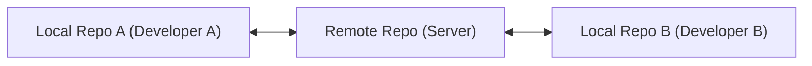
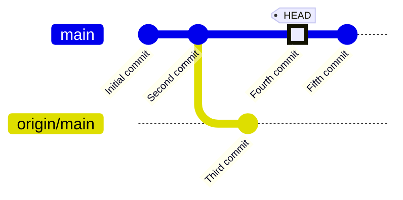
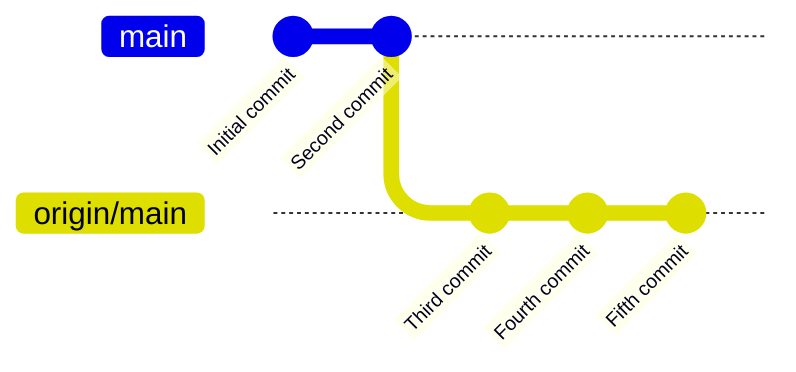
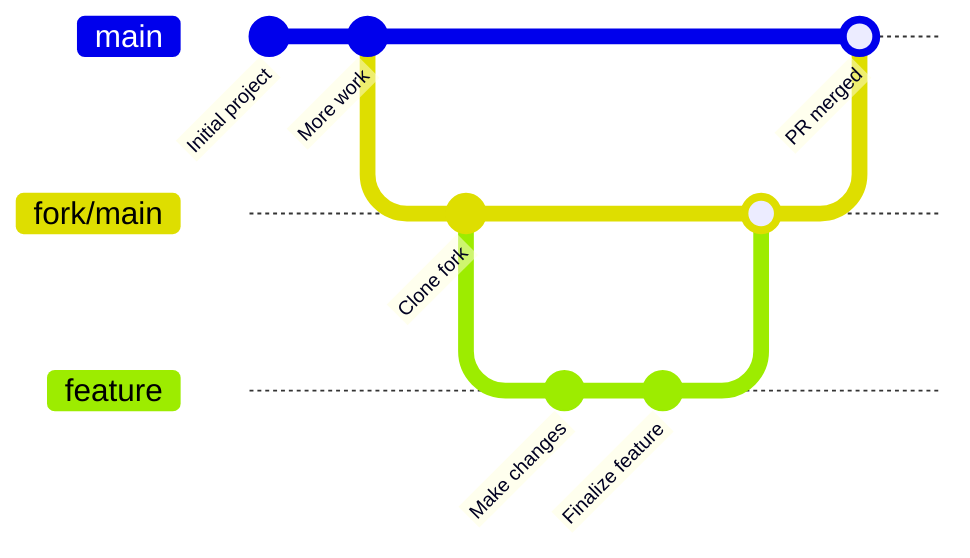
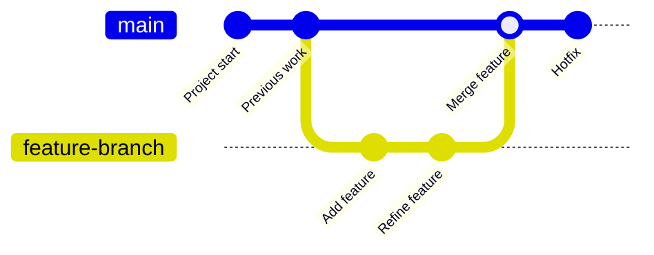
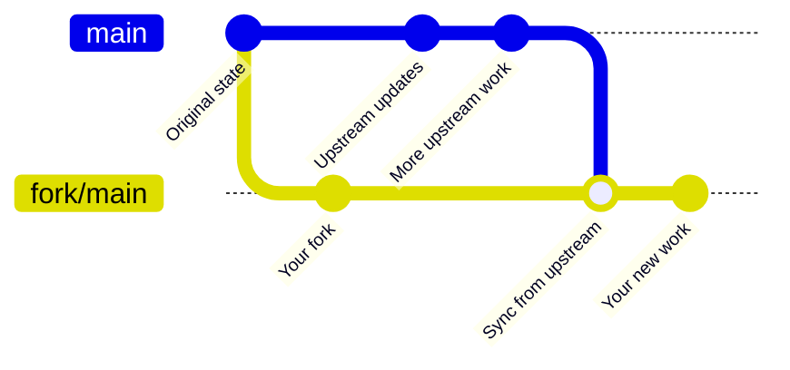
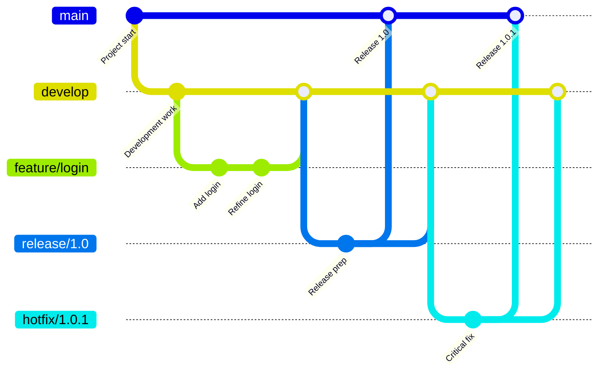

# Working with Remote Repositories

*Master the essential commands for collaborating with others through remote Git repositories.*

---

## Understanding Remote Repositories

### Remote Repository Concepts

A remote repository is a version of your project that is hosted on the internet or network somewhere. Git's distributed nature allows multiple developers to work independently and then share their changes.



### Common Remote Operations

- **Fetch**: Download objects and refs from remote without integrating them
- **Pull**: Fetch + integrate remote changes into your current branch
- **Push**: Upload your local branch commits to a remote repository
- **Clone**: Create a local copy of a remote repository

### Local vs Remote

Understanding the relationship between your local and remote branches:



The diagram above shows:

- Your local branch `main` has two commits ahead of the remote
- The remote tracking branch `origin/main` represents your last known state of the remote
- `HEAD` points to your current position on the local main branch

After pushing:



After pushing, the remote branch is updated with your local commits, and your local tracking reference to `origin/main` is updated to match.

---

## Setting Up Remote Connections

### Adding Remotes

Connect your local repository to a remote repository:

#### Add a remote named "origin"

```sh
git remote add origin https://github.com/username/repo.git
```

#### Add another remote with a different name

```sh
git remote add upstream https://github.com/original-owner/repo.git
```

### Viewing Remotes

Inspect your remote connections:

#### List all remotes

```sh
git remote
```

#### Show detailed information about remotes (URLs)

```sh
git remote -v
```

#### Show information about a specific remote

```sh
git remote show origin
```

### Renaming Remotes

Change the name of a remote:

#### Rename remote from "origin" to "destination"

```sh
git remote rename origin destination
```

### Removing Remotes

Delete a remote connection:

#### Remove the remote named "upstream"

```sh
git remote remove upstream
```

### Working with Multiple Remotes

Multiple remotes are common in open source projects:

#### Step 1: Add original repository as "upstream"

```sh
git remote add upstream https://github.com/original-owner/repo.git
```

#### Step 2: Fetch from upstream

```sh
git fetch upstream
```

#### Step 3: Merge changes from upstream's main branch

```sh
git merge upstream/main
```

> 💡 **Tip**: In a fork workflow, "origin" typically points to your fork and "upstream" points to the original repository.

---

## Fetching Updates

### Basic Fetch

Download objects and refs from a remote without merging:

#### Fetch updates from the "origin" remote

```sh
git fetch origin
```

#### Fetch updates from a specific remote

```sh
git fetch upstream
```

### Fetching Specific Branches

Fetch only certain branches from remote:

#### Fetch a specific branch

```sh
git fetch origin feature-branch
```

#### Fetch multiple specific branches

```sh
git fetch origin main develop feature-x
```

### Pruning When Fetching

Clean up deleted remote branches:

#### Fetch and remove any remote-tracking references that no longer exist

```sh
git fetch --prune
```

#### Short form

```sh
git fetch -p
```

#### Configure Git to always prune when fetching

```sh
git config --global fetch.prune true
```

### Fetch All Remotes

Fetch updates from all configured remotes:

#### Fetch from all remotes

```sh
git fetch --all
```

> 💡 **Tip**: Fetching is a safe operation that doesn't change your working directory or current branch.

---

## Pulling Changes

### Basic Pull

Fetch from a remote and integrate changes into the current branch:

#### Pull from the remote tracking branch

```sh
git pull
```

#### Pull from a specific remote and branch

```sh
git pull origin main
```

### Pull with Rebase

Pull using rebase instead of merge:

#### Pull with rebase

```sh
git pull --rebase
```

#### Pull from specific remote and branch with rebase

```sh
git pull --rebase origin feature-branch
```

#### Configure pull to use rebase by default

```sh
git config --global pull.rebase true
```

### Pull with Specific Options

Customize pull behavior:

#### Pull with verbose output

```sh
git pull --verbose
```

#### Pull without auto-commit (leaves changes staged)

```sh
git pull --no-commit
```

#### Pull only if it can be fast-forwarded

```sh
git pull --ff-only
```

### Pull vs Fetch + Merge

`git pull` is essentially a combination of `git fetch` and `git merge` (or `git rebase` with `--rebase`):

#### Step 1: Fetch remote changes

```sh
git fetch origin
```

#### Step 2: Merge remote changes (equivalent to pull)

```sh
git merge origin/main
```

These two steps combined are equivalent to:

```sh
git pull origin main
```

> ⚠️ **Warning**: `git pull` can lead to unexpected merge conflicts. For more control, some developers prefer using fetch and merge as separate steps.

---

## Pushing Changes

### Basic Push

Upload local branch commits to remote repository:

#### Push current branch to its tracking branch

```sh
git push
```

#### Push current branch to a specific remote branch

```sh
git push origin main
```

### Pushing to Specific Remotes

Select which remote to push to:

#### Push to a remote other than origin

```sh
git push upstream main
```

#### Push to all remotes

```sh
git remote | xargs -L1 git push
```

### Setting Upstream Branch

Configure branch tracking during push:

#### Push and set upstream branch

```sh
git push -u origin feature-branch
```

Or:

```sh
git push --set-upstream origin feature-branch
```

#### Check which branches are tracking what

```sh
git branch -vv
```

### Force Push

Override remote branch history (use with caution):

#### Force push (DANGER: overwrites remote history)

```sh
git push --force
```

#### Safer force push

```sh
git push --force-with-lease
```

> ⚠️ **Warning**: Force pushing rewrites history on the remote. Never force push to shared branches unless you're absolutely certain it won't affect other team members.

### Push Tags

By default, `git push` doesn't transfer tags:

#### Push a specific tag

```sh
git push origin v1.0.0
```

#### Push all tags

```sh
git push origin --tags
```

#### Push all annotated tags

```sh
git push origin --follow-tags
```

---

## Managing Remote Branches

### Listing Remote Branches

View branches in remote repositories:

#### List remote-tracking branches

```sh
git branch -r
```

#### List both local and remote-tracking branches

```sh
git branch -a
```

#### Show latest commit on each branch

```sh
git branch -rv
```

### Creating Remote Branches

Create a branch on the remote repository:

#### Push local branch to create remote branch with same name

```sh
git push origin local-branch
```

#### Create remote branch with different name

```sh
git push origin local-branch:remote-branch-name
```

### Tracking Remote Branches

Set up local branches to track remote branches:

#### Create a local branch that tracks a remote branch

```sh
git checkout -b feature-branch origin/feature-branch
```

#### Set an existing local branch to track a remote branch

```sh
git branch -u origin/feature-branch
```

#### Create and switch to a branch that tracks a remote branch

```sh
git checkout --track origin/feature-branch
```

### Deleting Remote Branches

Remove branches from remote repositories:

#### Delete a remote branch

```sh
git push origin --delete feature-branch
```

#### Alternative syntax

```sh
git push origin :feature-branch
```

---

## Authentication and Credentials

### HTTPS Authentication

Authenticate with username and password:

#### Clone with HTTPS URL

```sh
git clone https://github.com/username/repo.git
```

When you push, you'll be prompted for credentials.

### SSH Authentication

Authenticate using SSH keys (more secure):

#### Step 1: Generate SSH key pair

```sh
ssh-keygen -t ed25519 -C "your_email@example.com"
```

#### Step 2: Show public key to add to GitHub/GitLab

```sh
cat ~/.ssh/id_ed25519.pub
```

#### Step 3: Clone with SSH URL

```sh
git clone git@github.com:username/repo.git
```

### Credential Helpers

Store credentials to avoid typing them repeatedly:

#### Cache credentials in memory for 15 minutes

```sh
git config --global credential.helper cache
```

#### Store credentials permanently (in plaintext)

```sh
git config --global credential.helper store
```

#### Use the OS credential manager

For Windows:

```sh
git config --global credential.helper manager
```

For macOS:

```sh
git config --global credential.helper osxkeychain
```

### Personal Access Tokens

Modern authentication for HTTPS (replacing passwords):

```sh
# Use token as password when prompted
git clone https://github.com/username/repo.git
# Username: your-username
# Password: your-personal-access-token
```

> 💡 **Tip**: GitHub, GitLab, and other platforms now require personal access tokens instead of passwords for Git operations.

---

## Common Git Workflows

This section covers standard workflows for different collaboration models in Git.

### Fork and Pull Request Workflow

A workflow commonly used in open source projects where you don't have direct write access to the repository.



#### Step 1: Fork the Repository

Create your own copy of the repository on the remote server (done through GitHub/GitLab web interface).

#### Step 2: Clone Your Fork

Create a local copy of your fork:

```sh
git clone https://github.com/your-username/repo.git
```

#### Step 3: Add Original Repository as Upstream

Connect to the original repository to fetch updates later:

```sh
git remote add upstream https://github.com/original-owner/repo.git
```

#### Step 4: Create Feature Branch

Create a branch for your work:

```sh
git checkout -b feature-branch
```

#### Step 5: Make and Commit Changes

Implement your feature or fix:

```sh
# Make changes to code files
git add .
```

```sh
git commit -m "Add new feature"
```

#### Step 6: Push to Your Fork

Upload your changes to your remote fork:

```sh
git push -u origin feature-branch
```

#### Step 7: Create Pull Request

Submit your changes for review (done through GitHub/GitLab web interface).

### Direct Collaboration Workflow

A workflow used when you have direct write access to the shared repository.



#### Step 1: Clone the Shared Repository

Get a local copy of the shared repository:

```sh
git clone https://github.com/team/repo.git
```

#### Step 2: Create a Feature Branch

Create a branch for your specific work:

```sh
git checkout -b feature-branch
```

#### Step 3: Make and Commit Changes

Implement your feature or fix:

```sh
# Make changes to code files
git add .
```

```sh
git commit -m "Add new feature"
```

#### Step 4: Regularly Fetch Team Changes

Stay up to date with others' work:

```sh
git fetch origin
```

```sh
git rebase origin/main
```

Or alternatively:

```sh
git merge origin/main
```

#### Step 5: Push Your Branch

Share your work with the team:

```sh
git push -u origin feature-branch
```

#### Step 6: Merge or Create Pull Request

Either merge directly or create a pull request for review, depending on team practices:

```sh
# For direct merge (if permitted):
git checkout main
```

```sh
git merge feature-branch
```

```sh
git push origin main
```

### Fork Synchronization Workflow

Keeping your fork up to date with the original repository.



#### Step 1: Add Upstream Remote

Connect to the original repository (if not done already):

```sh
git remote add upstream https://github.com/original-owner/repo.git
```

#### Step 2: Fetch Upstream Changes

Download the latest updates from the original repository:

```sh
git fetch upstream
```

#### Step 3: Switch to Your Main Branch

Move to your local main branch:

```sh
git checkout main
```

#### Step 4: Merge Upstream Changes

Incorporate the updates into your local branch:

```sh
git merge upstream/main
```

#### Step 5: Push Updates to Your Fork

Update your remote fork with the synced changes:

```sh
git push origin main
```

### Gitflow Workflow

A more structured workflow for larger projects with scheduled releases.



#### Step 1: Initialize Gitflow

Set up the Gitflow branching structure:

```sh
git flow init
```

Or manually create develop branch:

```sh
git checkout -b develop main
```

#### Step 2: Start a Feature

Create a feature branch from develop:

```sh
git flow feature start login
```

Or manually:

```sh
git checkout -b feature/login develop
```

#### Step 3: Complete a Feature

Finish the feature, merging back to develop:

```sh
git flow feature finish login
```

Or manually:

```sh
git checkout develop
```

```sh
git merge --no-ff feature/login
```

```sh
git branch -d feature/login
```

#### Step 4: Create a Release

Branch off for release preparation:

```sh
git flow release start 1.0
```

Or manually:

```sh
git checkout -b release/1.0 develop
```

#### Step 5: Finish a Release

Merge to main and back to develop:

```sh
git flow release finish 1.0
```

Or manually:

```sh
git checkout main
```

```sh
git merge --no-ff release/1.0
```

```sh
git tag -a v1.0 -m "Version 1.0"
```

```sh
git checkout develop
```

```sh
git merge --no-ff release/1.0
```

```sh
git branch -d release/1.0
```

#### Step 6: Create a Hotfix

Fix critical issues in production:

```sh
git flow hotfix start bug-fix
```

Or manually:

```sh
git checkout -b hotfix/bug-fix main
```

#### Step 7: Finish a Hotfix

Apply the fix to both main and develop:

```sh
git flow hotfix finish bug-fix
```

Or manually:

```sh
git checkout main
```

```sh
git merge --no-ff hotfix/bug-fix
```

```sh
git tag -a v1.0.1 -m "Version 1.0.1"
```

```sh
git checkout develop
```

```sh
git merge --no-ff hotfix/bug-fix
```

```sh
git branch -d hotfix/bug-fix
```

---

## Troubleshooting Remote Operations

### Common Push Errors

**Rejected non-fast forward push:**

```plaintext
! [rejected]        main -> main (non-fast-forward)
```

Solution:

#### Step 1: Pull first to integrate remote changes

```sh
git pull origin main
```

#### Step 2: Or force push if you're sure (use with caution)

```sh
git push --force origin main
```

**Failed to push some refs:**

```plaintext
Updates were rejected because the remote contains work that you do not have locally
```

Solution:

#### Option 1: Fetch and merge the remote changes

```sh
git fetch origin
```

```sh
git merge origin/main
```

#### Option 2: Pull (fetch + merge in one step)

```sh
git pull
```

### Common Pull Errors

**Local changes would be overwritten:**

```plaintext
Your local changes would be overwritten by merge
```

Solution:

#### Option 1: Stash your changes

```sh
git stash
```

```sh
git pull
```

```sh
git stash pop
```

#### Option 2: Commit your changes first

```sh
git commit -am "WIP: Saving changes before pull"
```

```sh
git pull
```

**Merge conflicts:**

```plaintext
CONFLICT (content): Merge conflict in <filename>
```

Solution:

#### Step 1: Resolve conflicts in the files

Edit the files to resolve conflicts.

#### Step 2: Mark conflicts as resolved

```sh
git add <resolved-files>
```

```sh
git commit
```

#### Alternative: Abort the pull

```sh
git merge --abort
```

### Authentication Issues

**Permission denied errors:**

```plaintext
Permission to repository.git denied to user
```

Solutions:

#### Step 1: Check remote URL

```sh
git remote -v
```

#### Step 2: Update URL with correct credentials

```sh
git remote set-url origin https://username@github.com/username/repo.git
```

#### Alternative: Switch to SSH if you have it set up

```sh
git remote set-url origin git@github.com:username/repo.git
```

---

## Command Summary

| Operation | Command | Description |
|-----------|---------|-------------|
| Add Remote | `git remote add <name> <url>` | Connect to remote repo |
| View Remotes | `git remote -v` | List all remotes with URLs |
| Fetch | `git fetch <remote>` | Download without merging |
| Pull | `git pull <remote> <branch>` | Download and merge |
| Pull with Rebase | `git pull --rebase` | Download and rebase |
| Push | `git push <remote> <branch>` | Upload local commits |
| Set Upstream | `git push -u <remote> <branch>` | Push and track branch |
| Delete Remote Branch | `git push <remote> --delete <branch>` | Remove remote branch |
| List Remote Branches | `git branch -r` | Show remote branches |

---

## Related Topics

- [Setting up Git and initializing repositories](setup-and-init.md)
- [Creating, managing, and navigating branches](branching.md)
- [Combining branches with merge and rebase operations](merging-rebasing.md)
- [Temporarily storing changes and cleaning working directory](stash-clean.md)
- [Marking release points and version management](tags-releases.md)
