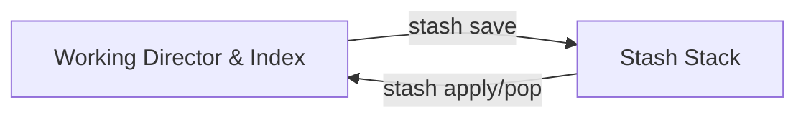
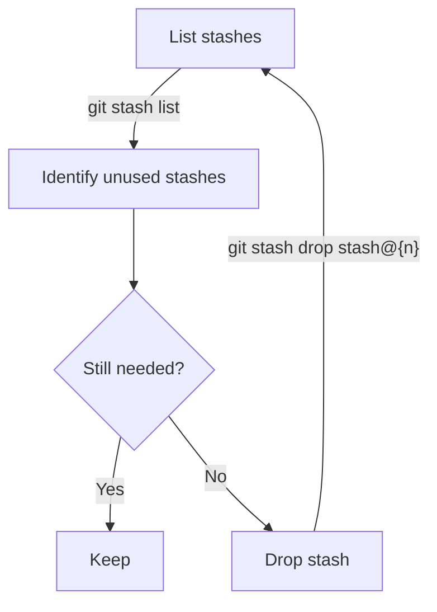
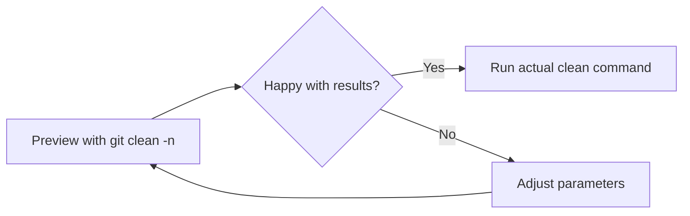
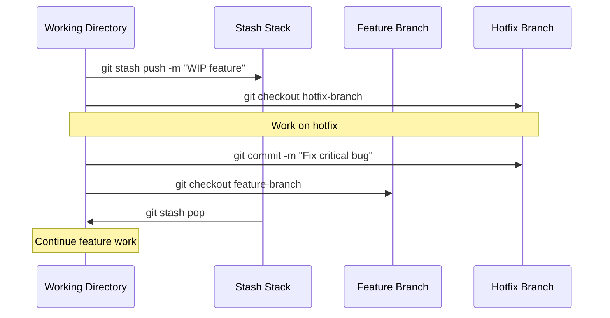

# Temporarily Stashing and Cleaning Working Directory

*Learn how to safely set aside work in progress and keep your working directory clean.*

---

## Understanding Git Stash

### When to Use Stash

Git stash is useful when you need to:

- Quickly switch context without committing incomplete work
- Move changes between branches
- Temporarily store work to pull the latest changes
- Experiment with alterations before deciding to keep them

### How Stash Works

Stashes are stored as commit objects in a special ref called `refs/stash`:



Stash operates as a stack, with the most recent stash at position `stash@{0}`.

---

## Basic Stash Operations

### Stashing Changes

Save your working directory and index state:

#### Basic stash - save all uncommitted changes

```sh
git stash
```

#### Same as git stash push (more explicit command)

```sh
git stash push
```

### Viewing Stashes

List and inspect stashed changes:

#### List all stashes

```sh
git stash list
```

#### Show the contents of the most recent stash

```sh
git stash show
```

#### Show the patch/diff of a stash

```sh
git stash show -p
```

#### Show a specific stash

```sh
git stash show stash@{1}
```

#### Show a specific stash with patch

```sh
git stash show -p stash@{1}
```

### Applying Stashes

Apply stashed changes back to your working directory:

#### Apply most recent stash and keep it in the stash list

```sh
git stash apply
```

#### Apply most recent stash and remove it from the stash list

```sh
git stash pop
```

#### Apply a specific stash

```sh
git stash apply stash@{2}
```

#### Pop a specific stash

```sh
git stash pop stash@{2}
```

> 💡 **Tip**: Use `apply` when you want to apply the same stash to multiple branches. Use `pop` when you're done with the stash.

### Dropping Stashes

Remove stashes when you no longer need them:

#### Drop the most recent stash

```sh
git stash drop
```

#### Drop a specific stash

```sh
git stash drop stash@{1}
```

#### Remove all stashes

```sh
git stash clear
```

> ⚠️ **Warning**: `git stash clear` removes all stashes without confirmation. Use with caution.

---

## Advanced Stash Techniques

### Stashing Specific Files

Save changes to selected files only:

#### Stash only specific files

```sh
git stash push path/to/file1.txt path/to/file2.js
```

#### Stash only specific files with a message

```sh
git stash push -m "Updated CSS styles" css/styles.css
```

### Stashing Untracked Files

Include untracked files in your stash:

#### Stash untracked files as well

```sh
git stash -u
```

Or:

```sh
git stash --include-untracked
```

#### Stash everything, including untracked and ignored files

```sh
git stash -a
```

Or:

```sh
git stash --all
```

### Creating Branches from Stashes

Start a new branch with stashed changes applied:

#### Create a branch from the most recent stash

```sh
git stash branch new-branch-name
```

#### Create a branch from a specific stash

```sh
git stash branch fix-header-issue stash@{1}
```

> 💡 **Tip**: This is useful when applying a stash causes conflicts in your current branch.

### Interactive Stashing

Select specific hunks or lines to stash:

#### Interactively choose which changes to stash

```sh
git stash -p
```

Or:

```sh
git stash --patch
```

This opens an interactive prompt where you can choose which changes to stash:

- `y` - stash this hunk
- `n` - don't stash this hunk
- `q` - quit and don't stash any remaining hunks
- `a` - stash this and all remaining hunks
- `d` - don't stash this or any remaining hunks
- `s` - split this hunk into smaller hunks
- `e` - manually edit this hunk

### Stash with a Message

Add descriptive messages to your stashes for better organization:

#### Stash with a descriptive message

```sh
git stash push -m "WIP: Refactoring authentication module"
```

---

## Cleaning the Working Directory

### Checking What Will Be Removed

Preview what would be deleted before actual cleaning:

#### Dry run to see what would be removed

```sh
git clean -n
```

#### Dry run including directories

```sh
git clean -dn
```

### Removing Untracked Files

Delete untracked files from your working directory:

#### Remove untracked files

```sh
git clean -f
```

### Removing Untracked Directories

Remove untracked directories and their contents:

#### Remove untracked directories

```sh
git clean -fd
```

### Removing Ignored Files

Remove files that are ignored by `.gitignore`:

#### Remove ignored files

```sh
git clean -fX
```

#### Remove both ignored and untracked files

```sh
git clean -fx
```

### Force Cleaning

For more aggressive cleaning:

#### Interactive mode: confirms before each file deletion

```sh
git clean -i
```

#### Forcefully remove untracked files, directories, and ignored files

```sh
git clean -fdx
```

> ⚠️ **Warning**: `git clean` permanently deletes files. Files cannot be recovered unless they're tracked somewhere else.

---

## Best Practices

### Stashing Best Practices

#### Use Descriptive Messages

Always include a clear message that describes what you're stashing:

```sh
git stash push -m "Description of what's being stashed"
```

This makes it much easier to identify stashes later:

```sh
$ git stash list
stash@{0}: On feature-branch: Description of what's being stashed
stash@{1}: On main: Fix for navbar styling
```

#### Avoid Long-Term Storage

Stashes are meant for temporary storage and can be easily lost with certain Git operations. Consider creating a branch instead for changes you want to keep for longer periods:

```sh
git stash branch temp-work-branch
```

#### Preview Stash Contents Before Applying

Always check what's in a stash before applying it to avoid unexpected changes:

```sh
git stash show -p
```

#### Regular Stash Maintenance

Keep your stash list clean by regularly reviewing and dropping unused stashes:



### Cleaning Best Practices

#### Always Run a Dry Run First

Before deleting any files, see what would be removed:



```sh
git clean -n
```

Example output:

```plaintext
Would remove temp.txt
Would remove logs/debug.log
Would remove build/output.tmp
```

#### Target Specific Directories

Be specific about what you're cleaning rather than cleaning the entire repository:

```sh
git clean -f specific/path/to/clean
```

#### Use Gitignore Instead of Repeated Cleaning

Instead of repeatedly cleaning generated files, add them to your `.gitignore`:

```diff
+ # Build outputs
+ build/
+ dist/
+ *.tmp
+ 
+ # Log files
+ logs/
+ *.log
```

#### Use Interactive Mode When Unsure

When in doubt, use interactive mode to confirm deletions:

```sh
git clean -i
```

Example interaction:

```plaintext
Would remove the following items:
  temp.txt  logs/debug.log  build/output.tmp
*** Commands ***
    1: clean   2: filter by pattern   3: select by numbers
    4: ask each   5: quit   6: help
What now> 4
Remove temp.txt [y/N]? y
Remove logs/debug.log [y/N]? n
Remove build/output.tmp [y/N]? y
```

### Workflow Integration

Using stash effectively in your daily workflow:



#### Context Switching Workflow

When you need to switch tasks but aren't ready to commit:

##### 1. Save your current work

```sh
git stash push -m "WIP: Feature X implementation"
```

##### 2. Switch to another branch for an urgent fix

```sh
git checkout hotfix-branch
```

##### 3. Complete and commit the urgent work

```sh
git commit -m "Fix critical bug"
```

##### 4. Return to your original task

```sh
git checkout feature-branch
```

##### 5. Restore your work in progress

```sh
git stash pop
```

#### Feature Branch Experimentation

Test a risky change without committing:

```sh
# Save current state
git stash push -m "Stable state before experiment"

# Try experimental changes
# ...make changes...

# If experiment fails, restore previous state
git stash pop

# If experiment succeeds, commit the changes
git add .
git commit -m "Implement successful experiment"
git stash drop
```

---

## Troubleshooting

### Recovering Lost Stashes

If you accidentally drop a stash, you might be able to recover it:

#### Find dangling commits that might be your stash

```sh
git fsck --no-reflog | grep commit
```

#### Look at potential lost stashes

```sh
git show <commit-hash>
```

#### If you find your stash, apply it

```sh
git stash apply <commit-hash>
```

### Resolving Stash Conflicts

When applying a stash causes conflicts:

#### 1. Resolve conflicts manually in your editor

#### 2. Stage resolved files

```sh
git add <resolved-file>
```

#### 3a. If you used 'git stash pop' and resolved conflicts

```sh
git reset
```

#### 3b. If you used 'git stash apply', drop the stash when done

```sh
git stash drop
```

> 💡 **Tip**: Using `git stash branch new-branch stash@{0}` can help avoid conflicts by creating a new branch from the commit the stash was created from.

---

## Command Summary

| Operation | Command | Description |
|-----------|---------|-------------|
| Stash changes | `git stash` | Save working changes temporarily |
| List stashes | `git stash list` | Show all stashes |
| Show stash | `git stash show -p` | Display stash changes in detail |
| Apply stash | `git stash apply` | Apply stash but keep in list |
| Pop stash | `git stash pop` | Apply and remove stash |
| Drop stash | `git stash drop` | Delete a stash from list |
| Clear stashes | `git stash clear` | Remove all stashes |
| Stash specific files | `git stash push <files>` | Stash only listed files |
| Stash with message | `git stash push -m "msg"` | Create annotated stash |
| Preview clean | `git clean -n` | Show what would be removed |
| Clean files | `git clean -f` | Remove untracked files |
| Clean directories | `git clean -fd` | Remove untracked directories |

---

## Related Topics

- [Essential everyday Git commands and workflows](basic-usage.md)
- [Working with remote repositories (push, pull, fetch)](remote-operations.md)
- [Marking release points and version management](tags-releases.md)
- [Solving common Git problems](troubleshooting.md)
