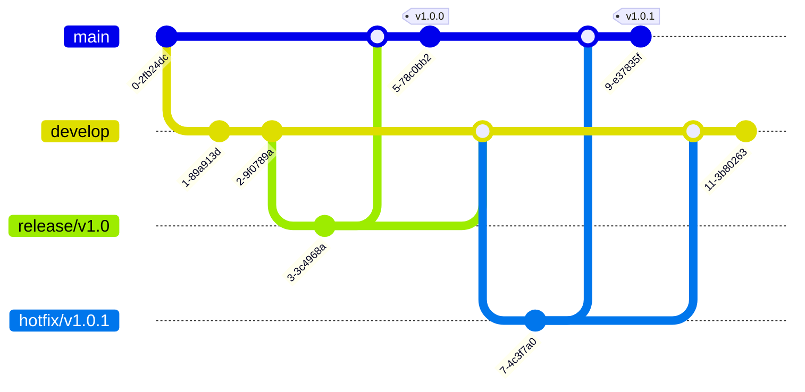
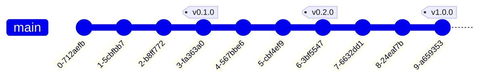

# Marking Release Points and Version Management

*Master the art of tagging commits and managing project versions with Git.*

---

## Understanding Tags

### What Are Git Tags?

Git tags are references that point to specific points in Git history. They're typically used to mark release points (v1.0, v2.0, etc.) providing a way to identify important milestones in your project timeline.


Unlike branches, tags don't change position as new commits are added; they remain permanently attached to the same commit unless manually moved.

### Types of Tags

Git supports two types of tags:

1. **Lightweight Tags**: Simple pointers to commits (like bookmarks)
2. **Annotated Tags**: Full objects stored in Git database with metadata, including tagger name, email, date, and a tagging message

### Tags vs. Branches

Understanding when to use tags versus branches:

| Tags | Branches |
|------|----------|
| Mark specific points in history | Track ongoing development |
| Don't move automatically | Move with new commits |
| Typically used for releases | Used for features, fixes, etc. |
| Are meant to be permanent | Can be temporary and merged |
| Are often used for versioning | Can be deleted or modified |

---

## Creating Tags

### Lightweight Tags

Create simple reference markers:

#### Create a lightweight tag

```sh
git tag v1.0.0-lw
```

#### Create a lightweight tag at a specific commit

```sh
git tag v0.9.0-lw a1b2c3d
```

### Annotated Tags

Create full tag objects with additional metadata:

#### Create an annotated tag

```sh
git tag -a v1.0.0 -m "Release version 1.0.0"
```

#### Create an annotated tag and open editor for message

```sh
git tag -a v1.0.0
```

### Tagging Previous Commits

Tags can be applied to any commit in history:

#### Tag a specific commit using its hash

```sh
git tag -a v0.8.0 -m "Beta release" 9fceb02
```

#### Tag a relative commit

```sh
git tag -a v0.7.0 HEAD~5
```

### Signing Tags

For extra security, create cryptographically signed tags:

#### Create a GPG-signed tag

```sh
git tag -s v1.0.0 -m "Signed release version 1.0.0"
```

#### Verify a signed tag

```sh
git tag -v v1.0.0
```

> 💡 **Tip**: Signed tags provide verification that the tag was created by a trusted source.

---

## Managing Tags

### Listing Tags

View the tags in your repository:

#### List all tags

```sh
git tag
```

#### List tags with patterns

```sh
git tag -l "v1.8.*"
```

#### List tags with annotations

```sh
git tag -n
```

#### Show verbose tag information

```sh
git tag -v
```

### Viewing Tag Information

Inspect details about specific tags:

#### Show tag data

```sh
git show v1.0.0
```

#### Display only the commit a tag points to

```sh
git rev-parse v1.0.0
```

#### List tags that contain a specific commit

```sh
git tag --contains a1b2c3d
```

### Searching and Filtering Tags

Find tags matching certain criteria:

#### Find tags matching a pattern

```sh
git tag -l "v1.*"
```

#### Find tags containing a specific commit

```sh
git tag --contains 7d9a5b2
```

#### Find tags not containing a specific commit

```sh
git tag --no-contains 7d9a5b2
```

### Sorting Tags

Sort tags by version number or date:

#### Sort by version number (requires git 2.0+)

```sh
git tag --sort=v:refname
```

#### Sort by tag creation date

```sh
git tag --sort=creatordate
```

#### Reverse the sort order

```sh
git tag --sort=-v:refname
```

---

## Working with Tags

### Checking Out Tags

Examine the code at a tagged release point:

#### View the repo at a specific tag

```sh
git checkout v1.0.0
```

#### Create a new branch from a tag

```sh
git checkout -b fix-branch v1.0.0
```

> ⚠️ **Warning**: Checking out a tag puts you in a "detached HEAD" state. Create a branch if you need to make changes.

### Comparing Tags

See differences between tagged versions:

#### Compare two tagged versions

```sh
git diff v1.0.0 v2.0.0
```

#### Show commits between tags

```sh
git log v1.0.0..v2.0.0
```

#### Show file changes between tags

```sh
git diff v1.0.0..v2.0.0 -- path/to/file
```

### Deleting Tags

Remove tags when they're no longer needed:

#### Delete a local tag

```sh
git tag -d v0.1.0-beta
```

#### Delete multiple tags

```sh
git tag -d v0.1.0-beta v0.2.0-beta
```

### Renaming Tags

Git doesn't have a direct tag rename command, but you can:

#### Rename a tag - Step 1: Create new tag

```sh
git tag new-tag-name old-tag-name
```

#### Rename a tag - Step 2: Delete old tag locally

```sh
git tag -d old-tag-name
```

#### Rename a tag - Step 3: Delete old tag from remote

```sh
git push origin :old-tag-name
```

#### Rename a tag - Step 4: Push new tag to remote

```sh
git push origin new-tag-name
```

### Moving Tags

Point a tag to a different commit:

#### Move a tag to current HEAD (delete and recreate)

```sh
git tag -d v1.0.0
git tag v1.0.0
```

#### Move a tag to a specific commit (with force)

```sh
git tag -f v1.0.0 a1b2c3d
```

> ⚠️ **Warning**: Moving tags that have been pushed to a remote repository can cause confusion. Only do this if absolutely necessary.

---

## Sharing Tags

### Pushing Tags to Remote

By default, `git push` doesn't transfer tags:

#### Push a specific tag

```sh
git push origin v1.0.0
```

#### Push all tags

```sh
git push origin --tags
```

#### Push all annotated tags

```sh
git push origin --follow-tags
```

### Fetching Tags

Get tags from remote repositories:

#### Fetch tags along with branches

```sh
git fetch
```

#### Fetch all tags that aren't already present

```sh
git fetch --tags
```

### Deleting Remote Tags

Remove tags from a remote repository:

#### Delete a remote tag

```sh
git push origin --delete v0.1.0-beta
```

Alternative syntax:

```sh
git push origin :refs/tags/v0.1.0-beta
```

---

## Semantic Versioning

### SemVer Format

[Semantic Versioning](https://semver.org/) provides a clear convention for version numbering:

```plaintext
MAJOR.MINOR.PATCH[-PRERELEASE][+BUILD]
```

Example: `2.4.1-alpha.1+20130313144700`

### Version Incrementing Rules

Guidelines for when to increment each version component:

1. **MAJOR**: Incompatible API changes
2. **MINOR**: Add functionality (backward-compatible)
3. **PATCH**: Bug fixes (backward-compatible)

#### Example SemVer tagging workflow


#### Create initial release tag

```sh
git tag -a v1.0.0 -m "Initial stable release"
```

#### Create patch release for bug fixes

```sh
git tag -a v1.0.1 -m "Fix critical bug in login flow"
```

#### Create minor release for new features

```sh
git tag -a v1.1.0 -m "Add user profile features"
```

#### Create major release for breaking changes

```sh
git tag -a v2.0.0 -m "Complete API redesign"
```

### Pre-release and Build Metadata

Use pre-release identifiers for pre-release versions:

#### Alpha version

```sh
git tag -a v1.0.0-alpha.1 -m "Alpha release"
```

#### Beta version

```sh
git tag -a v1.0.0-beta.1 -m "Beta release"
```

#### Release candidate

```sh
git tag -a v1.0.0-rc.1 -m "Release candidate 1"
```

---

## Release Workflows

### GitFlow Release Workflow

Using GitFlow for structured releases:



#### Step 1: Create a release branch

```sh
git checkout -b release/v1.0 develop
```

#### Step 2: Prepare the release

```sh
git commit -m "Bump version numbers"
```

#### Step 3: Tag the release

```sh
git tag -a v1.0.0 -m "Version 1.0.0"
```

#### Step 4: Merge to main

```sh
git checkout main
git merge --no-ff release/v1.0
```

#### Step 5: Merge back to develop

```sh
git checkout develop
git merge --no-ff release/v1.0
```

### Simple Tag-Based Releases

Simpler workflow using tags directly:



#### Step 1: Ensure main branch is stable

```sh
git checkout main
```

#### Step 2: Tag the release

```sh
git tag -a v1.0.0 -m "Version 1.0.0"
```

#### Step 3: Push the tag

```sh
git push origin v1.0.0
```

### GitHub Release Workflow

Creating releases on GitHub:

#### Step 1: Create and push a tag

```sh
git tag -a v1.0.0 -m "Version 1.0.0"
git push origin v1.0.0
```

#### Step 2: Create the release on GitHub

1. Go to your repository on GitHub
2. Navigate to "Releases" section
3. Click "Create a new release"
4. Select your tag
5. Add release notes and artifacts
6. Publish the release

### Automating Releases with CI/CD

Using CI/CD pipelines for automated releases:

```yaml
# Example GitHub Actions workflow
name: Create Release
on:
  push:
    tags:
      - 'v*'
jobs:
  build:
    runs-on: ubuntu-latest
    steps:
      - uses: actions/checkout@v2
      - name: Build
        run: |
          npm install
          npm run build
      - name: Create Release
        uses: actions/create-release@v1
        with:
          tag_name: ${{ github.ref }}
          release_name: Release ${{ github.ref }}
          draft: false
          prerelease: false
```

> 💡 **Tip**: Automated release processes can include building, testing, creating release notes, and publishing artifacts.

---

## Command Summary

| Operation | Command | Description |
|-----------|---------|-------------|
| Create tag | `git tag v1.0.0` | Create lightweight tag |
| Create annotated | `git tag -a v1.0.0 -m "msg"` | Create annotated tag |
| List tags | `git tag` | Show all tags |
| Show tag | `git show v1.0.0` | Display tag details |
| Push tags | `git push origin v1.0.0` | Push specific tag |
| Push all tags | `git push --tags` | Push all tags |
| Delete tag | `git tag -d v1.0.0` | Remove local tag |
| Delete remote tag | `git push origin --delete v1.0.0` | Remove remote tag |
| Checkout tag | `git checkout v1.0.0` | Examine tagged version |
| Tag old commit | `git tag v0.9.0 <commit-hash>` | Tag previous commit |

---

## Related Topics

- [Creating, managing, and navigating branches](branching.md)
- [Viewing project history and comparing changes](logs-diffs-history.md)
- [Working with remote repositories (push, pull, fetch)](remote-operations.md)
- [Established Git workflows for teams](development-workflows.md)
